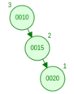
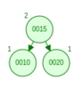
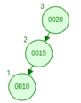
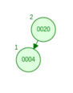
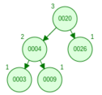

\let\oldsection\section
\maketitle
\thispagestyle{empty}
\clearpage

\tableofcontents
\pagenumbering{roman}
\clearpage

\listoftables
\clearpage

\listoffigures
\clearpage

\pagenumbering{arabic}
\setcounter{page}{1}


# 1) The assignment

## 1.1) AVL Tree

## 1.1.1) Testing:
 - Is the implementation working?
 - comparreson of 
 - performance analasis (Time complexity space)

 
 ## 1.1.2) Documentation
  Background, introduction intro AVL,paytree, redbakck trree, hash tables etc.
  programing language, which IDE are you using 
  Technical detail AVL balance collision, com

## 1.1.3) Describe testing
   - solutiong

   Performance
    time complexity table / graph

## 1.1.4) conclusion 
What is my conclusion of my opinion, findings which solution is better in which situation.
 - References
 - conclusion 

 submission date - 6th week, 7th wee there will be a presentation. 
 

# 1) Introduction

This report represents my findings from 
> Implement and then compare 4 implementations of data structures in terms of the effectiveness of insert, delete and search operations in different situations.

Throughout this paper, i will do my best to take you, the reader on a journey where i will be sheading a light on the execusion of this assignment. 

for this assignment, we will be implementing the datastructures in Java, and we will be utilizing VS Code as the IDE as it appears to be the most dynamic IDE.


For this exersice, i decited to use the `AVL-Tree` and the `RedBlack-Tree` datastructures. 

 - Guaranteed height of $O(log(n))$ for $n$ items

# 2) AVL Tree

## 2.1) Source code for the AVL-Tree

The datastructures used in this exersise, is a modified version of the solutions develloped by [@AlgotithmTutor-2019]. As good practics and also because of the exersise, we will firstly have ensure that the algorithm is behaving as expected before we look into the debth of its benchmarkings. We will therefor run through the some of the key elements which make up the 


### 2.1.1) The Node
Unlike the binary search tree, the AVL tree node comprizes of 5 members instead of only 3 members, this is because in the AVL tree, we will have to maintain information about the parent nodein addition to the child nodes, and also as this is a self-balancing binary search tree, each node will have to maintain information about its balance. 

```java
// data structure that represents a node in the tree
class Node {
	int data; 		// holds the key
	Node parent; 	// pointer to the parent
	Node left; 		// pointer to left child
	Node right; 	// pointer to right child
	int bf; 		// balance factor of the node

	public Node(int data) {
		this.data = data;
		this.parent = null;
		this.left = null;
		this.right = null;
		this.bf = 0;
	}
}
```

### 2.1.2) The insert method

 - Ordinary BST insert

```java
// insert the key to the tree in its appropriate position
	public void insert(int key) {
		// PART 1: Ordinary BST insert
		Node node = new Node(key);
		Node y = null;
		Node x = this.root;

		while (x != null) {
			y = x;
			if (node.data < x.data) {
				x = x.left;
			} else {
				x = x.right;
			}
		}

		// y is parent of x
		node.parent = y;
		if (y == null) {
			root = node;
		} else if (node.data < y.data) {
			y.left = node;
		} else {
			y.right = node;
		}

		// PART 2: re-balance the node if necessary
		updateBalance(node);
	}
```

### 2.1.3) Search Method

```java
private Node searchTreeHelper(Node node, int key) {
		if (node == null || key == node.data) {
			return node;
		}

		if (key < node.data) {
			return searchTreeHelper(node.left, key);
		} 
		return searchTreeHelper(node.right, key);
	}
```
### 2.1.4) Delete Method

```java
	private Node deleteNodeHelper(Node node, int key) {
		// search the key
		if (node == null) return node;
		else if (key < node.data) node.left = deleteNodeHelper(node.left, key);
		else if (key > node.data) node.right = deleteNodeHelper(node.right, key);
		else {
			// the key has been found, now delete it

			// case 1: node is a leaf node
			if (node.left == null && node.right == null) {
				node = null;
			}

			// case 2: node has only one child
			else if (node.left == null) {
				Node temp = node;
				node = node.right;
			}

			else if (node.right == null) {
				Node temp = node;
				node = node.left;
			}

			// case 3: has both children
			else {
				Node temp = minimum(node.right);
				node.data = temp.data;
				node.right = deleteNodeHelper(node.right, temp.data);
			}

		} 
```

### 2.1.5) Balancing method

```java
	// update the balance factor the node
	private void updateBalance(Node node) {
		if (node.bf < -1 || node.bf > 1) {
			rebalance(node);
			return;
		}

		if (node.parent != null) {
			if (node == node.parent.left) {
				node.parent.bf -= 1;
			} 

			if (node == node.parent.right) {
				node.parent.bf += 1;
			}

			if (node.parent.bf != 0) {
				updateBalance(node.parent);
			}
		}
	}
```

## 2.2) Testing the tree functionality
for the sake of testing the tree, we will be comparing our results with results from [@DavidGalles-2011]. 

### 2.2.1) Testing scenario: Left Rotation
Input array 

	[10, 15, 20]

the expected outcome according to [@DavidGalles-2011]



 


Initially, the value 10 is inserted and serves as the root node. Next, the value 15 is inserted and placed as the right child of the root node because it is greater than or equal to 10. The third value, 20, is also greater than the root node value and the right child value of 15, so it becomes the right child of the right child of the root node. Since this insertion causes the tree to become right-heavy and unbalanced, a balancing algorithm is invoked. This algorithm determines the balancing factor, which is given by:

$$BF(x) = h(RS(x)) - h(LS(x))$$

where $h(RS(x))$ is the height of the right subtree of node $x$ and $h(LS(x))$ is the height of the left subtree of node $x$. In this case, $h(RS(x))$ is 1 and $h(LS(x))$ is 0, so the balancing factor is 1. To restore balance to the tree, a `left` rotation is performed. After the rotation, the resulting tree is balanced.

```java
printing Nodes
R----15(BF = 0)
     L----10(BF = 0)
     R----20(BF = 0)
```

This test concludes that the nodes are correctly positioned. 


### 2.2.2) Testing scenario: Right Rotation

Input array 

	[20, 15, 10]

the expected outcome according to [@DavidGalles-2011]



 

The first value to be inserted is 20, which becomes the root node. The next value inserted is 15, which is less than 20 and is therefore placed as the left child of the root node. The third value inserted is 10, which is also less than 20 and less than the left child of the root node. Consequently, the value 10 becomes the left child of the left child of the root node. As a result, the tree becomes left-heavy and unbalanced, and the balancing algorithm is invoked. To restore balance to the tree, a right rotation is performed. After the rotation, the tree becomes balanced again.

```java
printing Nodes
R----15(BF = 0)
     L----10(BF = 0)
     R----20(BF = 0)
```
This test concludes that the nodes are correctly positioned. 
### 2.2.3) Testing scenario: Right/Left Rotation

Input array 

	[15, 25, 20]

the expected outcome according to [@DavidGalles-2011]


 

The first value to be inserted is 15, which becomes the root node. The next value inserted is 25, which is greater than 15 and is therefore placed as the right child of the root node. The third value inserted is 20, which is  greater than 15, but less than the right child of the root node 25. Consequently, the value 20 becomes the left child of the right child of the root node. As a result, the tree becomes right-heavy and unbalanced, and the balancing algorithm is invoked. To restore balance to the tree, a left rotation is performed. After the rotation, the tree becomes balanced again.

```java
printing Nodes
R----20(BF = 0)
     L----15(BF = 0)
     R----25(BF = 0)
```
This test concludes that the nodes are correctly positioned. 

### 2.2.4) Testing scenario: Left/Right Rotation

Input array 

	[25, 15, 20]

the expected outcome according to [@DavidGalles-2011]


 

The first value to be inserted is 25, which becomes the root node. The next value inserted is 15, which is less than 25 and is therefore placed as the left child of the root node. The third value inserted is 20, which is  less than 25, but greater than the left child of the root node 15. Consequently, the value 20 becomes the right child of the left child of the root node. As a result, the tree becomes left-heavy and unbalanced, and the balancing algorithm is invoked. To restore balance to the tree, a right rotation is performed. After the rotation, the tree becomes balanced again.

```java
printing Nodes
R----20(BF = 0)
     L----15(BF = 0)
     R----25(BF = 0)
```
This test concludes that the nodes are correctly positioned. 

### 2.2.5) More complex tests

Input array 

	[20, 4, 26, 3, 9, 15]

the expected outcome according to [@DavidGalles-2011]




 



when entering these values into our AVL-tree, the the result is 

```java
printing Nodes
R----9(BF = 0)
     L----4(BF = -1)
     |    L----3(BF = 0)
     R----20(BF = 0)
          L----15(BF = 0)
          R----26(BF = 0)
```
This test concludes that the nodes are correctly positioned. 

other similar tests have been performed with larger tree structures, and they all yealded in the same result

the following is a quick overview

input array [20, 4, 26, 3, 9, 21, 30, 2, 7, 11, 8]


```java
printing Nodes
R----9(BF = 0)
     L----4(BF = 0)
     |    L----3(BF = -1)
     |    |    L----2(BF = 0)
     |    R----7(BF = 1)
     |         R----8(BF = 0)
     R----20(BF = 1)
          L----11(BF = 0)
          R----26(BF = 0)
               L----21(BF = 0)
               R----30(BF = 0)
```

This test concludes that the nodes are correctly positioned. 


## 2.2) Benchmark testing
in the following tests, we will perform two sets of tests, where the first set of test comprizes of 100K randomply generated values and then another test with 10M randomly generated values. These values will then be used to perform a sort of benchmark test on the three methods `insert`, `search` and `delete`, while measuring the time duration for each operation and then plot these values in order to see the performance of the operations.

It should be noted, that when running n operations without measuring and logging the time, is significant faster than with the measuremens. This leads me to believe that the results from the following tests are distorted by the fact that we are measuring them. but for the sake of this assignment, these tests are deamed to suffice as they do show a pattern. 


### 2.2.1) Script used for the test

the script used for the three tests are more or less identical, the only diffrence between them is invoking the `insert`, `search` and `delete` methods.

```java
private static void insert_benchmark(int numInserts) {
	long startTime, endTime, elapsedTime;
	Random random = new Random();
	try {
		FileWriter writer = new FileWriter(InsertBenchmarkCSV);

		writer.append("Number of Inserts");
		writer.append(",");
		writer.append("Elapsed Time (ms)");
		writer.append("\n");

		// perform insert operations and measure time taken
		startTime = System.nanoTime();
		for (int i = 0; i < numInserts; i++) {
			int value = random.nextInt();

			// The Insert operation
			avlTree.insert(value);

			elapsedTime = (System.nanoTime() - startTime) / 1000000;

			writer.append(Integer.toString(i));
			writer.append(",");
			writer.append(Long.toString(elapsedTime));
			writer.append("\n");
		}

		writer.flush();
		writer.close();
	} catch (IOException e) {
		e.printStackTrace();
	}
}
```

### 2.2.1) 1M insert operations

For this test, we randomly generated 1M values and `inserted` them into the tree while measuring the time it took for each operation.


as indicated by the figure, the `insert` operations time complexity increases exponentially. this expression can also be expressed as $O(n^2)$.  however, it should also be noted that tinning this same test with less number of inserts, the graph actually follows a $O(log(n))$

### 2.2.2) 1M search operations


### 2.2.3) 1M delete operations


# 3) Red-Black tree
The Red-Black tree is also a datastructure which is derrivedfrom the binary search tree structure. It is a self balancing tree where each node carries infomration related to its color, (Red/Black). These colors are used as means to balance the tree after `insert` or `remove` of elements. 

Features: 
 1. A node is either red or black.
 2. The root and leaves (NIL) are black.
 3. If a node is red, then its children are black.
 4. All paths from a node to its (NIL) desendants contain the same number of black nodes


Time complexity:
 - Search $O(log(n))$
 - Insert $O(log(n))$
 - Remove $O(log(n))$

 Space complexity: $O(n)$

## 3.1) Source code for the Red-Black Tree

### 3.1.1) The Node

### 3.1.2) The insert method

### 3.1.2) The search method

### 3.1.2) The delete method

### 3.1.2) The balancing method

## 3.2 Testing the tree functionality

### 3.2.1) Testing scenarion Lefft rotation

### 3.2.2) Testing scenarion Right rotation

### 3.2.3) Testing scenarion Lefft/Right rotation

### 3.2.4) Testing scenarion Right/Lefft rotation

### 3.2.5) Mpre complex tests

## 3.3) Benchmark testing

### 3.3.1) scripts used for the test

### 3.3.2) Testing insert operation


### 3.3.2) Testing search operation


### 3.3.2) Testing delete operation


# 4) Cross comparrison, AVL VS Red-Black trees

## 4.1 Pro and con
AVL 						| RedBlack
--- 						| ---
Are strictly balanced 		| may not remain balanced at all time
additional rotations need compared to RedBlack trees | faster in terms of inserting and deleting
hence the isert and delete operations will execute slightly slower | general-purpose trees
--- | are used in Java official implementation of TreeMap and TreeSet


## 4.2) Operations

The following is an overview of the time and space complexity of Red-Black Tree operations:

| OPERATION 	| AVERAGE CASE 		| WORST CASE 	|
| --- 			| ---				| --- 			|
| Space			| $O(n)$			| $O(n)			|
| Search		| $O(log(n))$		| $O(log(n))$	|
| Insert		| $O(log(n))$		| $O(log(n))$	|
| Delete		| $O(log(n))$		| $O(log)(n))$ 	|

## 4.3) Rebalancing

# 5) Hashing
In this analysis, we will compare the performance of two different data structures: hash tables and self-balancing binary search trees. Hash tables are a popular data structure used in computer science to associate keys with values, and they support search and insert operations. With a good hash function, hash tables can provide lookups with a constant time of O(1) in the average case, making them ideal for storing large amounts of data. However, choosing a poor hash function can result in slow searches. To avoid collisions, we can use techniques such as chaining or linear hashing. In this analysis, we will compare the performance of these two techniques by implementing them in our own code and comparing their speed and efficiency.

# 5) References: 
