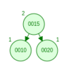
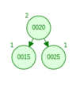
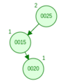
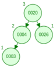
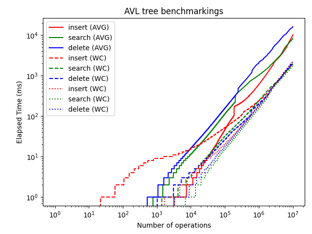
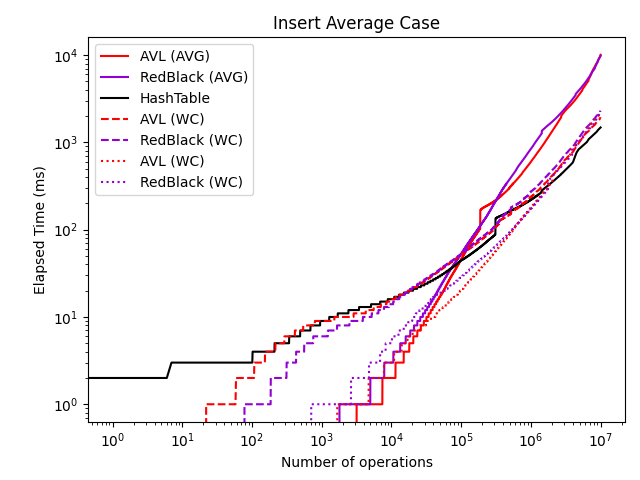
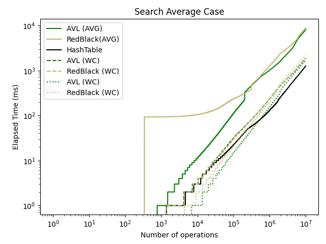

\let\oldsection\section
\maketitle
\thispagestyle{empty}
\clearpage

\tableofcontents
\pagenumbering{roman}
\clearpage

\listoftables
\clearpage

\listoffigures
\clearpage

\pagenumbering{arabic}
\setcounter{page}{1}


# 1) The assignment

## 1.1) AVL Tree

## 1.1.1) Testing:
 - Is the implementation working?
 - comparreson of 
 - performance analasis (Time complexity space)

 
 ## 1.1.2) Documentation
  Background, introduction intro AVL,paytree, redbakck trree, hash tables etc.
  programing language, which IDE are you using 
  Technical detail AVL balance collision, com

## 1.1.3) Describe testing
   - solutiong
   Performance
    time complexity table / graph

## 1.1.4) conclusion 
What is my conclusion of my opinion, findings which solution is better in which situation.
 - References
 - conclusion 

 submission date - 6th week, 7th wee there will be a presentation. 
 

# 1) Introduction

This report represents my findings from 
> Implement and then compare 4 implementations of data structures in terms of the effectiveness of insert, delete and search operations in different situations.

Throughout this paper, i will do my best to take you, the reader on a journey where i will be sheading a light on the execusion of this assignment. 

for this assignment, we will be implementing the datastructures in Java, and we will be utilizing VS Code as the IDE as it appears to be the most dynamic IDE.


For this exersice, i decited to use the `AVL-Tree` and the `RedBlack-Tree` datastructures. 

 - Guaranteed height of $O(log(n))$ for $n$ items

# 2) AVL Tree

## 2.1) Time and space complexity:

Consider $n$ as the number of nodes in the tree. in the worst and average case, basic data structure operations like `insert`, `search` and `delete` take $O(log(n))$. in such cases is where the AVL tree outperforms the binary search tree.

the compelexities for all operations, `insert`, `search` and `delete`, depend on the trees height. The AVL tree is a self-balancing binary search tree, so the tree's height $h$ is $O(log(n))$. Balancing the tree totatios is necessary, and it takes $O(1)$ time. So overall complexity in the worst case remains $O(log(n))$.

| **Operation** 	| **Average case** 		| **Worst case**	|
| --- 				| ---					| --- 				|
| Search			| $O(log(n))$			| $O(log(n))$		|
| Insert			| $O(log(n))$			| $O(log(n))$		|
| Delete			| $O(log(n))$			| $O(log(n))$ 		|

 The space complexity of the AVL tree is $O(n)$ in both the worst case and average case


## 2.2) Source code for the AVL-Tree

The datastructures used in this exersise, is a modified version of the solutions develloped by [@AlgotithmTutor-2019]. As good practics and also because of the exersise, we will firstly have ensure that the algorithm is behaving as expected before we look into the debth of its benchmarkings. We will therefor run through the some of the key elements which make up the 


### 2.2.1) The Node
Unlike the binary search tree, the AVL tree node comprizes of 5 members instead of only 3 members, this is because in the AVL tree, we will have to maintain information about the parent nodein addition to the child nodes, and also as this is a self-balancing binary search tree, each node will have to maintain information about its balance. 

```java
// data structure that represents a node in the tree
class Node {
	int data; 		// holds the key
	Node parent; 	// pointer to the parent
	Node left; 		// pointer to left child
	Node right; 	// pointer to right child
	int bf; 		// balance factor of the node

	public Node(int data) {
		this.data = data;
		this.parent = null;
		this.left = null;
		this.right = null;
		this.bf = 0;
	}
}
```

### 2.2.2) The insert method

 - Ordinary BST insert

```java
// insert the key to the tree in its appropriate position
	public void insert(int key) {
		// PART 1: Ordinary BST insert
		Node node = new Node(key);
		Node y = null;
		Node x = this.root;

		while (x != null) {
			y = x;
			if (node.data < x.data) {
				x = x.left;
			} else {
				x = x.right;
			}
		}

		// y is parent of x
		node.parent = y;
		if (y == null) {
			root = node;
		} else if (node.data < y.data) {
			y.left = node;
		} else {
			y.right = node;
		}

		// PART 2: re-balance the node if necessary
		updateBalance(node);
	}
```

### 2.2.3) Search Method

```java
private Node searchTreeHelper(Node node, int key) {
		if (node == null || key == node.data) {
			return node;
		}

		if (key < node.data) {
			return searchTreeHelper(node.left, key);
		} 
		return searchTreeHelper(node.right, key);
	}
```

### 2.2.4) Delete Method

```java
	private Node deleteNodeHelper(Node node, int key) {
		// search the key
		if (node == null) return node;
		else if (key < node.data) node.left = deleteNodeHelper(node.left, key);
		else if (key > node.data) node.right = deleteNodeHelper(node.right, key);
		else {
			// the key has been found, now delete it

			// case 1: node is a leaf node
			if (node.left == null && node.right == null) {
				node = null;
			}

			// case 2: node has only one child
			else if (node.left == null) {
				Node temp = node;
				node = node.right;
			}

			else if (node.right == null) {
				Node temp = node;
				node = node.left;
			}

			// case 3: has both children
			else {
				Node temp = minimum(node.right);
				node.data = temp.data;
				node.right = deleteNodeHelper(node.right, temp.data);
			}

		} 
```

### 2.2.5) Balancing method

```java
	// update the balance factor the node
	private void updateBalance(Node node) {
		if (node.bf < -1 || node.bf > 1) {
			rebalance(node);
			return;
		}

		if (node.parent != null) {
			if (node == node.parent.left) {
				node.parent.bf -= 1;
			} 

			if (node == node.parent.right) {
				node.parent.bf += 1;
			}

			if (node.parent.bf != 0) {
				updateBalance(node.parent);
			}
		}
	}
```

## 2.3) Testing the tree functionality
for the sake of testing the tree, we will be comparing our results with results from [@DavidGalles-2011]. 

### 2.3.1) Testing scenario: Left Rotation
Input array 

	[10, 15, 20]

the expected outcome according to [@DavidGalles-2011]


 


Initially, the value 10 is inserted and serves as the root node. Next, the value 15 is inserted and placed as the right child of the root node because it is greater than or equal to 10. The third value, 20, is also greater than the root node value and the right child value of 15, so it becomes the right child of the right child of the root node. Since this insertion causes the tree to become right-heavy and unbalanced, a balancing algorithm is invoked. This algorithm determines the balancing factor, which is given by:

$$BF(x) = h(RS(x)) - h(LS(x))$$

where $h(RS(x))$ is the height of the right subtree of node $x$ and $h(LS(x))$ is the height of the left subtree of node $x$. In this case, $h(RS(x))$ is 1 and $h(LS(x))$ is 0, so the balancing factor is 1. To restore balance to the tree, a `left` rotation is performed. After the rotation, the resulting tree is balanced.

```java
printing Nodes
R----15(BF = 0)
     L----10(BF = 0)
     R----20(BF = 0)
```

This test concludes that the nodes are correctly positioned. 


### 2.3.2) Testing scenario: Right Rotation

Input array 

	[20, 15, 10]

the expected outcome according to [@DavidGalles-2011]


 

The first value to be inserted is 20, which becomes the root node. The next value inserted is 15, which is less than 20 and is therefore placed as the left child of the root node. The third value inserted is 10, which is also less than 20 and less than the left child of the root node. Consequently, the value 10 becomes the left child of the left child of the root node. As a result, the tree becomes left-heavy and unbalanced, and the balancing algorithm is invoked. To restore balance to the tree, a right rotation is performed. After the rotation, the tree becomes balanced again.

```java
printing Nodes
R----15(BF = 0)
     L----10(BF = 0)
     R----20(BF = 0)
```
This test concludes that the nodes are correctly positioned. 

### 2.3.3) Testing scenario: Right/Left Rotation

Input array 

	[15, 25, 20]

the expected outcome according to [@DavidGalles-2011]


 

The first value to be inserted is 15, which becomes the root node. The next value inserted is 25, which is greater than 15 and is therefore placed as the right child of the root node. The third value inserted is 20, which is  greater than 15, but less than the right child of the root node 25. Consequently, the value 20 becomes the left child of the right child of the root node. As a result, the tree becomes right-heavy and unbalanced, and the balancing algorithm is invoked. To restore balance to the tree, a left rotation is performed. After the rotation, the tree becomes balanced again.

```java
printing Nodes
R----20(BF = 0)
     L----15(BF = 0)
     R----25(BF = 0)
```
This test concludes that the nodes are correctly positioned. 

### 2.3.4) Testing scenario: Left/Right Rotation

Input array 

	[25, 15, 20]

the expected outcome according to [@DavidGalles-2011]



 

The first value to be inserted is 25, which becomes the root node. The next value inserted is 15, which is less than 25 and is therefore placed as the left child of the root node. The third value inserted is 20, which is  less than 25, but greater than the left child of the root node 15. Consequently, the value 20 becomes the right child of the left child of the root node. As a result, the tree becomes left-heavy and unbalanced, and the balancing algorithm is invoked. To restore balance to the tree, a right rotation is performed. After the rotation, the tree becomes balanced again.

```java
printing Nodes
R----20(BF = 0)
     L----15(BF = 0)
     R----25(BF = 0)
```
This test concludes that the nodes are correctly positioned. 

### 2.3.5) More complex tests

Input array 

	[20, 4, 26, 3, 9, 15]

the expected outcome according to [@DavidGalles-2011]


 


when entering these values into our AVL-tree, the the result is 

```java
printing Nodes
R----9(BF = 0)
     L----4(BF = -1)
     |    L----3(BF = 0)
     R----20(BF = 0)
          L----15(BF = 0)
          R----26(BF = 0)
```
This test concludes that the nodes are correctly positioned. 

other similar tests have been performed with larger tree structures, and they all yealded in the same result

the following is a quick overview

input array [20, 4, 26, 3, 9, 21, 30, 2, 7, 11, 8]


```java
printing Nodes
R----9(BF = 0)
     L----4(BF = 0)
     |    L----3(BF = -1)
     |    |    L----2(BF = 0)
     |    R----7(BF = 1)
     |         R----8(BF = 0)
     R----20(BF = 1)
          L----11(BF = 0)
          R----26(BF = 0)
               L----21(BF = 0)
               R----30(BF = 0)
```

This test concludes that the nodes are correctly positioned. 


## 2.4) Benchmark testing
in the following tests, we will perform two sets of tests, where the first set of test comprizes of 100K randomply generated values and then another test with 10M randomly generated values. These values will then be used to perform a sort of benchmark test on the three methods `insert`, `search` and `delete`, while measuring the time duration for each operation and then plot these values in order to see the performance of the operations.

It should be noted, that when running n operations without measuring and logging the time, is significant faster than with the measuremens. This leads me to believe that the results from the following tests are distorted by the fact that we are measuring them. but for the sake of this assignment, these tests are deamed to suffice as they do show a pattern. 

### 2.4.1) Script used for the test

the script used for the three tests are more or less identical, the only diffrence between them is invoking the `insert`, `search` and `delete` methods.

```java
private static void insert_benchmark(int numInserts) {
	long startTime, endTime, elapsedTime;
	Random random = new Random();
	try {
		FileWriter writer = new FileWriter(InsertBenchmarkCSV);

		writer.append("Number of Inserts");
		writer.append(",");
		writer.append("Elapsed Time (ms)");
		writer.append("\n");

		// perform insert operations and measure time taken
		startTime = System.nanoTime();
		for (int i = 0; i < numInserts; i++) {
			int value = random.nextInt();

			// The Insert operation
			avlTree.insert(value);

			elapsedTime = (System.nanoTime() - startTime) / 1000000;

			writer.append(Integer.toString(i));
			writer.append(",");
			writer.append(Long.toString(elapsedTime));
			writer.append("\n");
		}

		writer.flush();
		writer.close();
	} catch (IOException e) {
		e.printStackTrace();
	}
}
```

### 2.4.2) Benchmarkings of the insert operations

For this test, we will measure the time duration for each `insert` operation, when inserting for 10 milion randomly generated values.

as indicated by the figure, the `insert` operations time complexity increases exponentially. this expression can also be expressed as $O(n^2)$.  however, it should also be noted that tinning this same test with less number of inserts, the graph actually follows a $O(log(n))$

### 2.4.3) Benchmarkings of the search operations

For this test, we will measure the time duration for each `search` operation, when inserting for 10 milion randomly generated values.

as indicated by the figure, the `search` operations time complexity increases exponentially. this expression can also be expressed as $O(n^2)$.  however, it should also be noted that tinning this same test with less number of inserts, the graph actually follows a $O(log(n))$

### 2.4.4) 1M delete operations

For this test, we will measure the time duration for each `delete` operation, when inserting for 10 milion randomly generated values.

as indicated by the figure, the `delete` operations time complexity increases exponentially. this expression can also be expressed as $O(n^2)$.  however, it should also be noted that tinning this same test with less number of inserts, the graph actually follows a $O(log(n))$



# 3) Red black Tree

Similar to AVL trees, Red black trees are also self balancing binary search trees, and they are actually the prefered choice among devellopers and frameworks.

however the main diffrence between them is that red black trees are not as strictly balanced as avl trees. In the avl tree, we had one important rule; ***The height of the children of any given node  must always remain between 1 and -1***. but here we are not even dealing with heights, instead we are dealing with **red nodes** and **black nodes**.

In red black trees, the height between two sub trees might sometimes exceed one and that is why we say that it is not as strictly balances as AVL trees.


The Red-Black tree is also a datastructure which is derrivedfrom the binary search tree structure. It is a self balancing tree where each node carries infomration related to its color, (Red/Black). These colors are used as means to balance the tree after `insert` or `remove` of elements. 

## 3.1) Features:

 1. A node is either red or black.
 2. The root and leaves (NIL) are black.
 3. If a node is red, then its children are black.
 4. All paths from a node to its (NIL) desendants contain the same number of black nodes


## 3.2) Time complexity:

 - Search $O(log(n))$
 - Insert $O(log(n))$
 - Remove $O(log(n))$

 Space complexity: $O(n)$


## 3.3 Pro and con
**AVL**						| **RedBlack**
--- 						| ---
Are strictly balanced 		| may not remain balanced at all time
additional rotations need compared to RedBlack trees | faster in terms of inserting and deleting
hence the isert and delete operations will execute slightly slower | general-purpose trees
--- | are used in Java official implementation of TreeMap and TreeSet


## 3.4) Operations

The following is an overview of the time and space complexity of Red-Black Tree operations:

| **Operation** 	| **Average case** 		| **Worst case** 	|
| --- 				| ---					| --- 				|
| Space				| $O(n)$				| $O(n)				|
| Search			| $O(log(n))$			| $O(log(n))$		|
| Insert			| $O(log(n))$			| $O(log(n))$		|
| Delete			| $O(log(n))$			| $O(log)(n))$ 		|


## 3.5) Source code for the RedBlack-Tree

### 3.5.1) The Node

```java
// data structure that represents a node in the tree
class RBNode {
	int data; // holds the key
	RBNode parent; // pointer to the parent
	RBNode left; // pointer to left child
	RBNode right; // pointer to right child
	int color; // 1 . Red, 0 . Black
}
```

### 3.5.2) The insert method

```java
// insert the key to the tree in its appropriate position
	// and fix the tree
	public void insert(int key) {
		// Ordinary Binary Search Insertion
		RBNode node = new RBNode();
		node.parent = null;
		node.data = key;
		node.left = TNULL;
		node.right = TNULL;
		node.color = 1; // new node must be red

		RBNode y = null;
		RBNode x = this.root;

		while (x != TNULL) {
			y = x;
			if (node.data < x.data) {
				x = x.left;
			} else {
				x = x.right;
			}
		}

		// y is parent of x
		node.parent = y;
		if (y == null) {
			root = node;
		} else if (node.data < y.data) {
			y.left = node;
		} else {
			y.right = node;
		}

		// if new node is a root node, simply return
		if (node.parent == null){
			node.color = 0;
			return;
		}

		// if the grandparent is null, simply return
		if (node.parent.parent == null) {
			return;
		}

		// Fix the tree
		fixInsert(node);
	}
```

```java
// fix the red-black tree
	private void fixInsert(RBNode k){
		RBNode u;
		while (k.parent.color == 1) {
			if (k.parent == k.parent.parent.right) {
				u = k.parent.parent.left; // uncle
				if (u.color == 1) {
					// case 3.1
					u.color = 0;
					k.parent.color = 0;
					k.parent.parent.color = 1;
					k = k.parent.parent;
				} else {
					if (k == k.parent.left) {
						// case 3.2.2
						k = k.parent;
						rightRotate(k);
					}
					// case 3.2.1
					k.parent.color = 0;
					k.parent.parent.color = 1;
					leftRotate(k.parent.parent);
				}
			} else {
				u = k.parent.parent.right; // uncle

				if (u.color == 1) {
					// mirror case 3.1
					u.color = 0;
					k.parent.color = 0;
					k.parent.parent.color = 1;
					k = k.parent.parent;	
				} else {
					if (k == k.parent.right) {
						// mirror case 3.2.2
						k = k.parent;
						leftRotate(k);
					}
					// mirror case 3.2.1
					k.parent.color = 0;
					k.parent.parent.color = 1;
					rightRotate(k.parent.parent);
				}
			}
			if (k == root) {
				break;
			}
		}
		root.color = 0;
	}
```

### 3.5.3) Search Method

```java
	private RBNode searchTreeHelper(RBNode node, int key) {
		if (node == TNULL || key == node.data) {
			return node;
		}

		if (key < node.data) {
			return searchTreeHelper(node.left, key);
		} 
		return searchTreeHelper(node.right, key);
	}

```

### 3.5.4) Delete Method

```java
private void deleteNodeHelper(RBNode node, int key) {
		// find the node containing key
		RBNode z = TNULL;
		RBNode x, y;
		while (node != TNULL){
			if (node.data == key) {
				z = node;
			}

			if (node.data <= key) {
				node = node.right;
			} else {
				node = node.left;
			}
		}

		if (z == TNULL) {
			System.out.println("Couldn't find key in the tree");
			return;
		} 

		y = z;
		int yOriginalColor = y.color;
		if (z.left == TNULL) {
			x = z.right;
			rbTransplant(z, z.right);
		} else if (z.right == TNULL) {
			x = z.left;
			rbTransplant(z, z.left);
		} else {
			y = minimum(z.right);
			yOriginalColor = y.color;
			x = y.right;
			if (y.parent == z) {
				x.parent = y;
			} else {
				rbTransplant(y, y.right);
				y.right = z.right;
				y.right.parent = y;
			}

			rbTransplant(z, y);
			y.left = z.left;
			y.left.parent = y;
			y.color = z.color;
		}
		if (yOriginalColor == 0){
			fixDelete(x);
		}
	}
```

```java
// fix the rb tree modified by the delete operation
	private void fixDelete(RBNode x) {
		RBNode s;
		while (x != root && x.color == 0) {
			if (x == x.parent.left) {
				s = x.parent.right;
				if (s.color == 1) {
					// case 3.1
					s.color = 0;
					x.parent.color = 1;
					leftRotate(x.parent);
					s = x.parent.right;
				}

				if (s.left.color == 0 && s.right.color == 0) {
					// case 3.2
					s.color = 1;
					x = x.parent;
				} else {
					if (s.right.color == 0) {
						// case 3.3
						s.left.color = 0;
						s.color = 1;
						rightRotate(s);
						s = x.parent.right;
					} 

					// case 3.4
					s.color = x.parent.color;
					x.parent.color = 0;
					s.right.color = 0;
					leftRotate(x.parent);
					x = root;
				}
			} else {
				s = x.parent.left;
				if (s.color == 1) {
					// case 3.1
					s.color = 0;
					x.parent.color = 1;
					rightRotate(x.parent);
					s = x.parent.left;
				}

				if (s.right.color == 0 && s.right.color == 0) {
					// case 3.2
					s.color = 1;
					x = x.parent;
				} else {
					if (s.left.color == 0) {
						// case 3.3
						s.right.color = 0;
						s.color = 1;
						leftRotate(s);
						s = x.parent.left;
					} 

					// case 3.4
					s.color = x.parent.color;
					x.parent.color = 0;
					s.left.color = 0;
					rightRotate(x.parent);
					x = root;
				}
			} 
		}
		x.color = 0;
	}
```


### 3.5.5) Balancing method

```java
	// rotate left at node x
	public void leftRotate(RBNode x) {
		RBNode y = x.right;
		x.right = y.left;
		if (y.left != TNULL) {
			y.left.parent = x;
		}
		y.parent = x.parent;
		if (x.parent == null) {
			this.root = y;
		} else if (x == x.parent.left) {
			x.parent.left = y;
		} else {
			x.parent.right = y;
		}
		y.left = x;
		x.parent = y;
	}

	// rotate right at node x
	public void rightRotate(RBNode x) {
		RBNode y = x.left;
		x.left = y.right;
		if (y.right != TNULL) {
			y.right.parent = x;
		}
		y.parent = x.parent;
		if (x.parent == null) {
			this.root = y;
		} else if (x == x.parent.right) {
			x.parent.right = y;
		} else {
			x.parent.left = y;
		}
		y.right = x;
		x.parent = y;
	}
```

## 3.6) Testing the tree functionality

### 3.6.1) Testing scenario: Left Rotation

### 3.6.2) Testing scenario: Right Rotation

### 3.6.4) Testing scenario: Left/Right Rotation

### 3.6.5) More complex tests

## 3.7) Benchmark testing

### 3.7.1) Script used for the test

```java
private static void insert_benchmark(int[] arr, String fileName) {
	long startTime, elapsedTime;
	try {
		FileWriter writer = new FileWriter(fileName);

		writer.append("Number of Inserts");
		writer.append(",");
		writer.append("Elapsed Time (ms)");
		writer.append("\n");

		// perform insert operations and measure time taken
		startTime = System.nanoTime();
		for (int i = 0; i < arr.length; i++) {
			RedBlackTree.insert(arr[i]);

			elapsedTime = (System.nanoTime() - startTime) / 1000000;

			writer.append(Integer.toString(i));
			writer.append(",");
			writer.append(Long.toString(elapsedTime));
			writer.append("\n");
		}

		writer.flush();
		writer.close();
	} catch (IOException e) {
		e.printStackTrace();
	}
}
```


# 4) Hash table

in this section we will be looking into hash table datastructures and two diffrent approaches to collosion resolution. 

Problem:
options for Search operations
 - liniar search, compares the searched value with all values in the list --> $O(n)$
 - Binary Search, the array is already sorted, we identify the mid by looking at min and max. and then compare if the value we are searching for is greater than or less than the mid value, if the value is less, then we can simply disregard the upper hafl of the array, and we repete the process. untill we find the result. this approach is much faster as we reduce the array by half for each operation. -- $O(log(n))$

unfortunatly the values are never sorted, so we would have to sort the values in the array 

arrays can be used to provide $O(1)$ searches using indexes.  

 - Hashing is a technique used for storing, retrieving and removing information as quick as possible.
 - it is a process of converting a arbitrary size key into fixed sized value. the conversion is done via special function called hash function.
 - the operations supported by hashing such as storing, retrieving and removing information have average runtime complexity of $O(1)$.

What are hash functions?
- a hash function simply takes an arbatrary size key and provides fixed size value also called as index. 

Modular hash function
- a modular hash function simply takes a ey and size, returns remainder by dividing key by size
- the remainder is used as an index to store they key in an array of provided size. 

$$index=h(key)={key \% size}$$


as indicated by this example, the ideal scenario is to match the key  value directly to an array position so that it would be 1:1, but the issue with this is if the key space comprizes of large values, the corosponding array would have to be very large, and the majority of the array would not be in use, we and use the hash function to re alocate the key values to a smaller array. 

The equation you provided is a simple hash function that maps a given key to an index in a hash table.

The hash function computes the remainder of the key when divided by the size of the hash table. This operation is denoted by the % symbol, which is the modulo operator.

The resulting index represents the position in the hash table where the key-value pair should be stored. This technique is commonly known as modulo hashing, or the modulo method.

Note that the effectiveness of this hash function depends on the distribution of the keys. If the keys are evenly distributed, the resulting indices will be spread out across the hash table, leading to a more efficient use of space. However, if the keys are clustered together, collisions may occur, causing multiple keys to map to the same index, and potentially degrading performance.


**What is a hash table?**
- it is a generalized from of an array.
- it stores data in fomr of `key-value` pair.
- it converts `key` to an `index` using `hash` function.
- Taking the `index` we store `key-value` in array.
- The primary operations supported by HashTavle are 
  - `put(key, value)` - adds `key=value` pair against unique key.
  - `get(key,)` - Get `value` for the provided `key`
  - `remove(key)` - Removes the `key-value` pair from the hash table
- Average running time is of $O(1)$
- Java Collections Framework has HashMap class - if we want to deal with key-value pair and HashSet class if we want to deal with only keys. 


**Collision Resolution Technique (Seperate chaining).**

Seperate chaining
in the example we encounter collision in index 5, and so in ordet solve this collision, we simply insert a list into the hashtable at index 5, so that we can store more infomration there. so when this list grows, it will look like a chain. 
- singly linked list
- doubly linked list
- circulary singularly linked list

linked list termonology
each linked list starts off with the head, each node points to the next node, and the last node points to `null`. 
each node comprizes of three attributes, index, value and pointer to next node. 


## 4.1) Source code for the Hash table

### 4.1.1) The Node
**How to represent a HashNode.**
Representation of a HashNode in HashTable
A HashNode class in HashTable consists of three data members.
1) K key - It is a unique value which helps in storing data. Here, K signifies generic type.
2) V value - It is the data that is stored based on location computed by key. here V signifies generic type.
3) HashNode next - it referes to next HashNode in chain of hash nodes. 

How to implement a hash HashTable (Seperate chanining). 

HashTable Terminology


```java
public class HashTable{
	private HashNode[] buckets;
	private int numOfBuckets;       // Capacity
	private int size;               // Number of key value pairs in hash table or number of hash nodes in a HashTable

	// Constructor
    public HashTable(){
		this(10);          // default capacity
	}

	public HashTable(int capacity){
		this.numOfBuckets=capacity;
		this.buckets=new HashNode[numOfBuckets];
        this.size = 0;
	}

	private class HashNode{
		private Integer key; 	    // Can be generic
		private String value; 	    // Can be generic
		private HashNode next;      // reference to next HashNode

		public HashNode(Integer key, String value){
			this.key = key;
			this.value = value;
		}
	}

    public int size(){
        return size;
    }

    public boolean isEmphty(){
        return size == 0;
    }

    public void put(Integer key, String value){

    }

    public String get(Integer key){
        return null;
    }

    public String remove(Integer key){
        return null;
    }
}
```


all of these methods have a time complexity of $O(1)$, which is the average time complexity for the HashTable.


### 4.1.2) The insert method

**How to put a key-value parir in a HashTable**

in the following we will be using the modular hash function 

```java
// Modular Hash Function
public int getBucketIndex(Integer key){
	return key % numOfBuckets;
}
```

when inserting the nodes in to the buckets, there are variouse strategies on how to go about this, you could insert them based on some sorting logic such as sorting in a asending or decending order of the keys. 

as the initial HashTable is emphty, we simply insert the node to the top of the list (head). 

but before we insert the node, we have to first make sure that the space is not ocupied, because if there is already something we are encountering a collission. which means we eill have to manage the insert in a diffrent way. 
we dont know hoe many items are stored in the node, but we do know 

this function will take the key and divide the key by the number of buckets, and the remainder would be the new index. 

we need to check and veryfy that the key which we wish to insert is not already existing in the linked list, if the key is already there, then we would simply just update the value, otherwise we will have to add this new key to the list. 
```java
public void insert(Integer key, String value){
		if(key==null || value==null){
			throw new IllegalArgumentException("Key or Value is null!");
		}

		int bucketIndex = getBucketIndex(key);
		HashNode head = buckets[bucketIndex];
		while(head!=null){
			if(head.key.equals(key)){
				head.value=value;
				return;
			}
			head=head.next;
		}
		size++;
		head=buckets[bucketIndex];
		HashNode node = new HashNode(key, value); // (key, value) --> null
		node.next = head;
		buckets[bucketIndex]=node;
    }

```

### 4.1.2) The search method
```java
	public String get(Integer key){
		if(key==null){
			throw new IllegalArgumentException("Key or Value is null!");
		}

		int bucketIndex = getBucketIndex(key); 
		HashNode head = buckets[bucketIndex];
		while(head!=null){
			if(head.key.equals(key)){
				return head.value;
			}
			head = head.next;
		}
        return null;
    }
```
### 4.1.2) The delete method
```java
public String remove(Integer key){
	if(key==null){
		throw new IllegalArgumentException("Key is null!");
	}
	int bucketIndex = getBucketIndex(key);
	HashNode head = buckets[bucketIndex];	// (21, "Tom") ->(31, "Harry") ->(41, "Sana") -> null
	HashNode previous = null;
	
	// we compare to see if the key is found in the list. 
	while(head!=null){
		if (head.key.equals(key)){
			break;
		}
		previous=head;
		head=head.next;
	}

	// if head is == null, then we didnt find the key in the list.
	if(head == null){
		return null;
	}
	size--;

	if(previous!=null){
		// this will be used if we are removing a node in a list
		previous.next = head.next;
	}else{
		// This is only used if we are removing the first node
		buckets[bucketIndex] = head.next;
	}
	return null;
}
```

## 4.2 Testing the functionality

## 4.3) Benchmark testing

### 4.3.1) scripts used for the test

### 4.3.2) Testing insert operation

### 4.3.2) Testing search operation

### 4.3.2) Testing delete operation


# 5) Comparison between the algorithms
In the following three figures, we will comparing the results from each algorithm. the tree figures corospond to the `insert`, `search` and `delete` operations, where we have measured the time for each operation, for 10.000.000 operations. 



as indicated by Figure 10, both the AVL- and RedBlack trees appear to follow a very similar pattern, while the Hash Table appears to be much more effective. 




as indicated by Figure 11, both the AVL- and RedBlack trees appear to follow a very similar pattern, while the Hash Table appears to be much more effective. 


as indicated by Figure 12, both the AVL- and RedBlack trees appear to follow a very similar pattern, while the Hash Table appears to be much more effective. 

# 6) References: 
