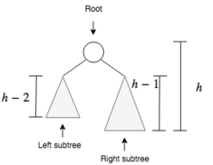
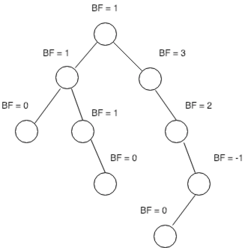
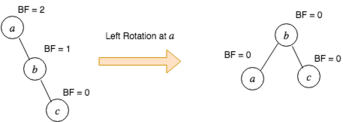
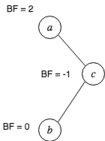
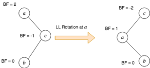

\let\oldsection\section
\maketitle
\thispagestyle{empty}
\clearpage

\tableofcontents
\pagenumbering{roman}
\clearpage

\listoftables
\clearpage

\listoffigures
\clearpage

\pagenumbering{arabic}
\setcounter{page}{1}


# 1) Introduction
Data structures and algorithms play a fundamental role in computer science and are essential for solving complex problems efficiently. In this assignment, we will be exploring the topic of `search in dynamic sets`, which involves various algorithms designed to search for elements in dynamic sets.

The main objective of this assignment is to implement and compare four different data structures in terms of their effectiveness in `insert`, `delete`, and `search` operations in different situations. The four data structures include two implementations of `binary search trees (BVS)` with different balancing algorithms, and two implementations of `hash tables` with different collision resolution methods.

The assignment requires the implementation of these data structures as separate source files, and the documentation of the implementations, testing scenarios, and the achieved results in a technical documentation file. It is also mandatory to submit a test program that measures the effectiveness of the implemented data structures. **The quality of testing and the processing of results in the documentation will mainly be evaluated**.

The technical documentation should contain detailed testing scenarios that identify the most suitable situations for each of the implementations. It should also include tables and graphs that compare the performance (speed) of individual solutions. As the results depend on the implementation of the solution and the test scenarios, it is important to document various different test scenarios to ensure accurate results.

In summary, this assignment offers an opportunity to explore and implement various data structures and algorithms in the context of searching in dynamic sets. Through this assignment, students will gain valuable experience in implementing data structures and analyzing their performance.

# 1) Self balancing binary search trees comparison
Before we move on, let's examine the outcome of implementing this new requirement for balance factor. We argue that by ensuring that the balance factor of a tree is always -1, 0, or 1, we can achieve better Big-O performance for important operations. To understand how this balance condition affects the worst-case tree, we must consider two possibilities: a left-heavy tree and a right-heavy tree. To illustrate this, we can examine trees of heights 0, 1, 2, and 3, and Figure 2 depicts the most imbalanced left-heavy tree that is possible under the new balance factor requirement.

## 1.1) AVL tree

AVL trees are binary search trees that are balanced in terms of height. This implies that the height of an AVL tree is proportional to the logarithm of the number of nodes in the tree `log(n)`. 

> *The height of a (sub) tree indicates how far the root is from the lowest node. Therefore, a (sub) tree that consists of only a root node has a height of 0.*

The AVL tree ensures height balance through a specific property, which dictates that the difference between the heights of the left and right subtrees of each node should not exceed one. This balance property is checked and maintained after every `insert` or `delete` operation through AVL `rotate`, which restores balance if needed.

> *The heights of the left and right subtrees differ by at most 1. If hl be the height of the left subtree and hr be the height of the right subtree, then,*
>
> $$|h_l-h_r|\leq1$$
>

For a tree to qualify as an AVL tree, each of its nodes must adhere to the specified balance property. If this condition is not met by any of the nodes, the tree must be restructured to ensure that the property holds. The following proof aims to demonstrate that the AVL property guarantees that the height of the tree will be proportional to the logarithm of the number of nodes in the tree $\log(n)$.

To illustrate this, let us consider an AVL tree as shown in Figure 1. Let h represent the height of the tree, and Nh denote the number of nodes present in the tree at height h.



The sum of the number of nodes in the left and right subtrees, along with the root node, equals the total number of nodes in the tree.

$$N_h=N_{h-1}+N_{h-2}+1$$

The recurrence relation is homogeneous and similar to the one for the Fibonacci numbers. The solution to this recurrence relation is...

$$N_h = {\varphi^h \over \sqrt5}$$

Where $\varphi$ is the golden ratio. If we take the  $log(\varphi)$ on both sides, we get 

$$h={1,44 \log_2(N_h)}$$

This proves that the height of the AVL tree is in the order of $\log(n)$.

## 1.1.1) The Balancing Factor
The balancing factor $(BF)$ of a node, denotes tha there is a difference of heights $(h)$ between the left $(LS)$ and right subtree $(LS)$ of the node. 

$$BF(x)=h(RS(x))-h(LS(x))$$

in an AVL tree, the balancing factor must be $-1$, $0$ or $1$. if the balancing factor of a node is greater than $1$ (right heavy) or less than -1 (left heavy), the node needs to be rebalanced. Figure 2 shows a tree with a balance factor




## 1.2) AVL tree rotations
If a node's balance factor exceeds the values of -1 or 1, we execute tree rotations on that particular node to achieve balance within the tree. Such rotations modify the tree's arrangement and ensure its equilibrium. The AVL tree employs four different types of rotations, which are explained below.

### 1.2.1) Left Rotation $(LL)$
Figure 3 illustrates the left rotation on AVL tree.



The tree at the left side of Figure 3 is right heavy. To fix this, we must perform a left rotation on node a . This is done in the following steps.

 - $b$ becomes the new root
 - $a$ takes ownership of $b$’s child as its right child, or in this case, null
 - $b$ takes ownership of $a$ as its left child.
 
 In AVL tree, we perform the left rotation $(LL)$ on node x
 when

- Node x is right heavy


### 1.2.1) Left Rotation $(RR)$
Figure 4 illustrates the right rotation.


We fix the tree on the left side of Figure 4 using following steps.

 - $b$ becomes the new root.
 - $c$ takes ownership of $b$’s right child, as its left child. In this case, that value is null.
 - $b$ takes ownership of $c$, as its right child.
In AVL tree, we perform the right rotation $(RR)$ on node $x$ when

 - Node $x$ is left heavy
 - Node $x$’s left subtree is not right heavy

### 1.2.1) Left Rotation $(LR)$

Sometimes a single rotation is not sufficient to balance an unbalanced tree. Consider a tree given in Figure 5.



Since node $a$ is right heavy, first thing that comes in mind is to perform the left rotation $(LL)$. Let’s see what happens if we do the left rotation on node a.



As we can see in the figure, the tree after the left rotation is still *un-balanced*. Therefore the single left operation is not effective in this case. To fix this we do the following using two step rotation.

 - Perform the *right rotation* on the right subtree. In the above figure, perform the right rotation on node $c$ (NOT $a$).
 - Perform the left rotation on the root node.

This is illustrated in Figure 7 below.


We perform the left right rotation $(LR)$ on node $x$ when

 - Node $x$ is right heavy
 - Node $x$’s right subtree is left heavy

### 1.2.2) Left Rotation $(RL)$

$RL$ rotation is symmetric to $LR$ rotation. In $RL$ rotation, we do the following

 - Perform the *left* rotation on the left subtree. 
 - Perform the *right* rotation on the root node. 
 
 This is illustrated in Figure 8.


We perform the right left rotation $(LR)$ on node $x$ when

 - Node $x$ is left heavy
 - Node $x$’s left subtree is right heavy

## 1.3) Operations on AVL tree


# 3.2) AVL Tree Implementation in Java
In our solution, we will be utilizing th source code from [AVL Tree](https://www.programiz.com/dsa/avl-tree). However, 

```java
class Node {
    int item, height;
    Node left, right;

    Node(int d) {
        item = d;
        height = 1;
    }
}
```
unlike the binary search tree, the we need to keep track of the height for each node, which is why class members include the `height` in addition to the `item`, `left` and `right` 

## 1.2) Red-Black tree


# References: 
 - https://algorithmtutor.com/Data-Structures/Tree/AVL-Trees/

 - https://www.cs.usfca.edu/~galles/visualization/AVLtree.html