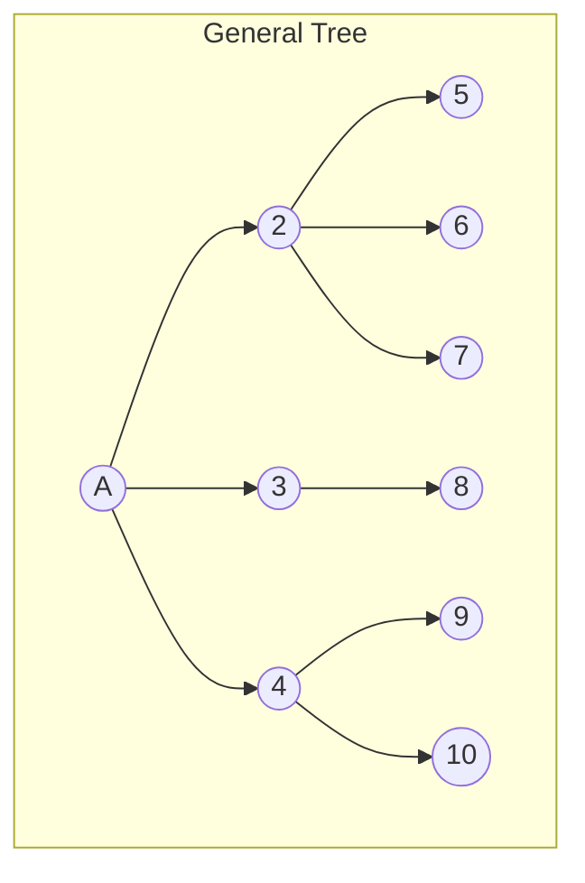
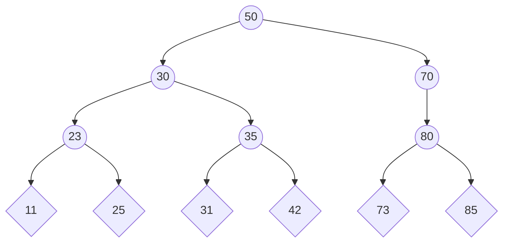
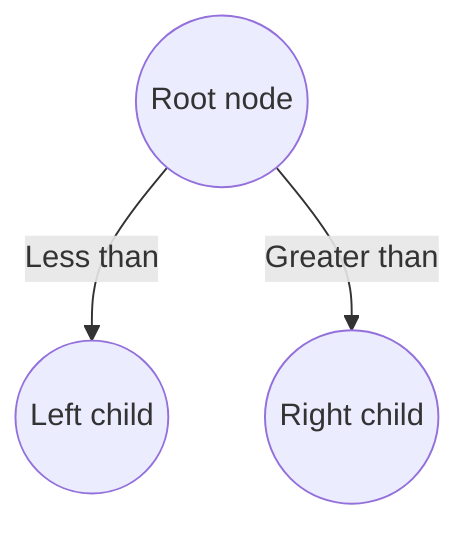

# Datastructures and algorithms

# 1) Introduction

In this assignment, we will be implementing, testing and comparing the results from four different types of data structures. The programing language for the implementations in this assignment has been chosen to be in python. This will be the first time im working with the python language, which also implies that there will be a learning curve during the execution of the project. 

# 2) Objective:
The primary objective of the assignment is to: 
 > ***Implement and then compare 4 implementations of data structures in terms of the effectiveness of insert, delete and search operations in different situations***
 
 Also, In the technical documentation, your task is to 
 > **document all implemented data structures and provide detailed testing scenarios, based on which you have found out in which situations which of these implementations are more effective.**

And finally, it is also required to 
> **submit a program that is used to test and measure the effectiveness of these implementations as a single source file (it contains the main function).**

# 3) Implementation of the AVL Tree
in this chapter, we will be implementing the AVL tree, and in so doing, we will also be having a closer look at what makes the tree work. The sources for this documentation are listed below. 

Source: 
- [AVL Tree implementation in Java](https://www.happycoders.eu/algorithms/avl-tree-java/)
- [AVL Tree](https://www.programiz.com/dsa/avl-tree)
- [AVL Trees with Implementation in C++, Java, and Python](https://algorithmtutor.com/Data-Structures/Tree/AVL-Trees/)
- [DSA-2023-cvičenie](https://docs.google.com/presentation/d/11uQIvDZZdD8kY-pdTTmgsfwI9LZtwurd0kl-Wx18fhI/edit#slide=id.g1de0d66c01a_6_0)
- [mermaid-cheat-sheet](https://jojozhuang.github.io/tutorial/mermaid-cheat-sheet/)

The AVL-tree source code is based on the solution provided by https://www.programiz.com/dsa/avl-tree, however, it should be noted discrepancies have been identified between the results from the provided source code and when simulating the same approach on https://www.cs.usfca.edu/~galles/visualization/AVLtree.html. 

as we will be directing the source code and elaborating on the different features and functionalities, i believe we will be able to identify the cause of the discrepancy and perhaps solve the issue along the way.

# 3) Binary Search tree (BST)


```mermaid
graph TB
    subgraph Binary Tree
        A2((1))-->B2((2))
        A2-->C2((3));
        B2-->E2((4))
        B2-->F2((5))
        C2-->H2((6))
        C2-->I2((7))
    end
 ```

```mermaid
graph TB       
    subgraph Binary Search Tree
        A3((8))-- Less than -->B3((3))
        A3-- Greater than -->C3((10))
        B3-->D3((1))
        B3-->E3((6))
        C3-->F3((9))
        C3-->G3((14))
        E3-->H3((4))
        E3-->I3((7))
    end

```




The basic operations of a binary search tree are 
- create
- insert
- delete
- search
- 

    

## 3.1) What is a AVL tree ? 

> *An AVL tree is a balanced binary search tree – that is, a binary search tree in which the heights of the left and right subtrees of each node differ by at most one.
> After each insert and delete operation, this invariant is verified, and the balance is restored by AVL rotation if necessary.* 

[HappyCoders][1]

## 3.2) The Balancing Factor
The balancing factor "BF" of a node, denotes tha there is a difference of heights "H" of the right and left subtree (`node.right` and `node.left`)



> BF(node) = H(node.right) - H(node.left)

the height of a none-existent subtree is -1 (one less than the height of a subtree consisting of only one node)

- If the balance factor is < 0, the node is said to be left-heavy.
- If the balance factor is > 0, the node is said to be right-heavy.
- A balance factor of 0 represents a balanced node.

In an AVL tree, the balance factor at each node is -1, 0, or 1.

## 3.1) Height of an AVL Tree

> *The height of a (sub) tree indicates how far the root is from the lowest node. Therefore, a (sub) tree that consists of only a root node has a height of 0.*

[HappyCoders][1]

# 3.2) AVL Tree Implementation in Java
In our solution, we will be utilizing th source code from [AVL Tree](https://www.programiz.com/dsa/avl-tree). However, 

```java
class Node {
    int item, height;
    Node left, right;

    Node(int d) {
        item = d;
        height = 1;
    }
}
```
unlike the binary search tree, the we need to keep track of the height for each node, which is why class members include the `height` in addition to the `item`, `left` and `right` 


```java
// Tree class
class AVLTree {
    Node root;

    int height(Node N) {
        if (N == null)
            return 0;
        return N.height;
    }

    int max(int a, int b) {
        return (a > b) ? a : b;
    }

    Node rightRotate(Node y) {
        Node x = y.left;
        Node T2 = x.right;
        x.right = y;
        y.left = T2;
        y.height = max(height(y.left), height(y.right)) + 1;
        x.height = max(height(x.left), height(x.right)) + 1;
        return x;
    }

    Node leftRotate(Node x) {
        Node y = x.right;
        Node T2 = y.left;
        y.left = x;
        x.right = T2;
        x.height = max(height(x.left), height(x.right)) + 1;
        y.height = max(height(y.left), height(y.right)) + 1;
        return y;
    }

    // Get balance factor of a node
    int getBalanceFactor(Node N) {
        if (N == null)
            return 0;
        return height(N.left) - height(N.right);
    }

    // Insert a node
    Node insertNode(Node node, int item) {

        // Find the position and insert the node
        if (node == null)
            return (new Node(item));
        if (item < node.item)
            node.left = insertNode(node.left, item);
        else if (item > node.item)
            node.right = insertNode(node.right, item);
        else
            return node;

        // Update the balance factor of each node
        // And, balance the tree
        node.height = 1 + max(height(node.left), height(node.right));
        int balanceFactor = getBalanceFactor(node);
        if (balanceFactor > 1) {
            if (item < node.left.item) {
                return rightRotate(node);
            } else if (item > node.left.item) {
                node.left = leftRotate(node.left);
                return rightRotate(node);
            }
        }
        if (balanceFactor < -1) {
            if (item > node.right.item) {
                return leftRotate(node);
            } else if (item < node.right.item) {
                node.right = rightRotate(node.right);
                return leftRotate(node);
            }
        }
        return node;
    }

    Node nodeWithMimumValue(Node node) {
        Node current = node;
        while (current.left != null)
            current = current.left;
        return current;
    }

    // Delete a node
    Node deleteNode(Node root, int item) {

        // Find the node to be deleted and remove it
        if (root == null)
            return root;
        if (item < root.item)
            root.left = deleteNode(root.left, item);
        else if (item > root.item)
            root.right = deleteNode(root.right, item);
        else {
            if ((root.left == null) || (root.right == null)) {
                Node temp = null;
                if (temp == root.left)
                    temp = root.right;
                else
                    temp = root.left;
                if (temp == null) {
                    temp = root;
                    root = null;
                } else
                    root = temp;
            } else {
                Node temp = nodeWithMimumValue(root.right);
                root.item = temp.item;
                root.right = deleteNode(root.right, temp.item);
            }
        }
        if (root == null)
            return root;

        // Update the balance factor of each node and balance the tree
        root.height = max(height(root.left), height(root.right)) + 1;
        int balanceFactor = getBalanceFactor(root);
        if (balanceFactor > 1) {
            if (getBalanceFactor(root.left) >= 0) {
                return rightRotate(root);
            } else {
                root.left = leftRotate(root.left);
                return rightRotate(root);
            }
        }
        if (balanceFactor < -1) {
            if (getBalanceFactor(root.right) <= 0) {
                return leftRotate(root);
            } else {
                root.right = rightRotate(root.right);
                return leftRotate(root);
            }
        }
        return root;
    }

    void preOrder(Node node) {
        if (node != null) {
            System.out.print(node.item + " ");
            preOrder(node.left);
            preOrder(node.right);
        }
    }

    // Print the tree
    private void printTree(Node currPtr, String indent, boolean last) {
        if (currPtr != null) {
            System.out.print(indent);
            if (last) {
                System.out.print("R----");
                indent += "   ";
            } else {
                System.out.print("L----");
                indent += "|  ";
            }
            System.out.println(currPtr.item);
            printTree(currPtr.left, indent, false);
            printTree(currPtr.right, indent, true);
        }
    }

    // Driver code
    public static void main(String[] args) {
        AVLTree tree = new AVLTree();
        tree.root = tree.insertNode(tree.root, 33);
        tree.root = tree.insertNode(tree.root, 13);
        tree.root = tree.insertNode(tree.root, 53);
        tree.root = tree.insertNode(tree.root, 9);
        tree.root = tree.insertNode(tree.root, 21);
        tree.root = tree.insertNode(tree.root, 61);
        tree.root = tree.insertNode(tree.root, 8);
        tree.root = tree.insertNode(tree.root, 11);
        tree.printTree(tree.root, "", true);
        tree.root = tree.deleteNode(tree.root, 13);
        System.out.println("After Deletion: ");
        tree.printTree(tree.root, "", true);
    }
}
```

[1]: https://www.happycoders.eu/algorithms/avl-tree-java/