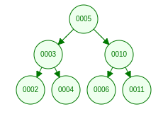
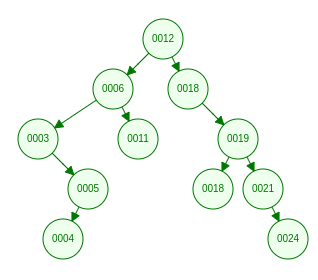

# Datastructure and algorithms

# 1) Introduction

As a part of the datastructures and alghorithms subject, we will in this document investigate the functionality of four datastructures, and then compare the results from them in terms of effectiveness of `insert`, `delete` and `search` operations in diffrent situations. 

the first two datastructures will be of the `binary search tree` (BVS), and then we will be implementing two diffrent `balancing algorithms`. 

the second two data structures will be of the `hash table` type, with `collision resolutions` and `size adjustments`. 

# 2) The binary tree

We will in this section have a closer look at the data structure of a general `tree algorithm`, and elaborate on how it is constructed and its functions. and then we will expand uppon the tree by adding two types balancing algorithms and then finally compare the results.

This section is divided up into two parts, where the first part will elaborate more on the theoretical aspects, and the secont part will be focusing more on the coding aspects. 

We will be using the tutorial found on https://algorithmtutor.com/ as the basis for the implementation. 

Binary trees are very useful datastructures which are used in the field of computer science. 

> ***The binary trees are a type of tree where each node has maximum two degree. That means each node can have at most 2 child nodes.***

Source: [Binary Trees](https://algorithmtutor.com/Data-Structures/Tree/Binary-Trees/)

A binary tree is a common datastructure used in software devellopment, we ususally visualize the trees by representing it as a collection of nodes which are pointing at other nodes. 

**Definition:**
 - `Nodes` -- Circles
 - `Edges` -- Connection lines

 ## Types of Binary tree
 - Rooted Binary tree
 - Full Binary tree
 - Complete Binary tree
 - Perfect binary tree

Properties of th

## 2.1) The Binary Tree Object

## 2.2) The Node

The first node is refered to as the `root node` and the susequent nodes are then refered to a `child nodes`. All nodes follow the same golden rule: a node can have 0, 1 or two child nodes. the most outer nodes are refered to as the leaf nodes, as they do not have any child nodes. 

In python, we create a object by creating a class. and then inside this objct, we can hen add diffrent methodfs and constructors and etc. which make up the class. We therefore start by creating the class `BinaryTree` as this object will represent the binary tree and all its methods. 

as we have mentioned in the theory, a tree comprises of a `Node` and each node contains a `value` and also each node can have up to two `child nodes`. All nodes in the tree have the same attributes, which is why we have the opertunity to utilize recursive coding technicques. 

in the following, we create the `BinaryTree` class, which has a initialization method, also known as a constructor. when we instanciate the BinaryTree class, we create a new object, containing a single node, and three attributes which are left blank for the time beeing. 


```python
class BinaryTree:
    def __init__(self, val=None):
        self.left = None
        self.right = None
        self.val = val

my_tree = BinaryTree()
```

## 2.2) The Insert method

the golden rule of the tree is that the child nodes contain values which are either greater than or less than the value of the parent node, and the left child holds values which are less than nd the right child contains values which are greater than. this also meand that there is a sequence wich will play a role in the final tree structure. As an example, we add values to a tree in a sequential manner and elaborate on each step.

**Example:**

Step 1 - we insert the value 5. as this is the first value, this will be represented as a single node, also known as the root node. and with no child nodes. 

Step 2 - we enter a new value of 10 into the tree. The value 10 is compared with the root node, and is determined greater than the root node, and is therefore places as a right child

Step 3 - we enter a value of 6 into the tree. the value 6 is compared with the root node, and is determined as greater than 5, and now because we already have a right child, the value 6 is then compared to the value 10 and is determined as less than, and the value 6 is therefore added as a left child to the node which contains the value 10.

Step 4 - insert 3, compare with root node 3 < 5. three is added as left child of root. 
step 5 - insert 2, compared with root node 2 < 5. we move down the tree and compare 2 < 3, and the value two is added as left child.

step 6 - insert 4, compared with root node 4 < 5. we move down the left and compare 4 > 3 and we add the value four as a right node. 

step 7 - insert 11, compard with root node 11 > 5. we move down to the right child, and compare 11 > 10, and the value 11 is added as a right child. 



The way the insert function works is that it can be broken down to 4 main functions:

1) **Current value == null:** 
where the first one is for cases where we are adding the root node. the thing which is unique about this situation is that there is no value to compare the new `val` with, which is why we first check if there is any value in `self`, if `self.val` does not have a value, then we insert the new value `val` into `self`.
```python
        # Current value == null - nothing
        if not self.val:
            self.val = val
            return
```

2) **New value == Current value** 
```python
        # New value == Current value
        if val == self.val:
            return
```


3) **New value < Current value:** If the new value we wish to insert to the tree is less than th value in the root node and the left child has a node object, we will then insert the value in the metod of that object, which is a recursive function. 
However, if the left child reference does not contain a node object, we create a new node object with the value of `val`. 


```python
        # New value < current value - left child
        if val < self.val:
            if self.left:
                self.left.insert(val)
                return
            self.left = BinaryTree(val)
            return
```
4) **New value > current value** if the new value is greater than `self`, then we will first check if the right child node is ocupied, if not then we create a new node object and and add the `val` there, otherwise we trigger the insert function of the already existing object. 

```python
        # New value > Current value - basically "else"
        if self.right:
            self.right.insert(val)
            return
        self.right = BinaryTree(val)
```

in our binary tree, we do not wish to have dublicated values, which is why we add an additional chriteria which states that if the current value is equal the an existing value, we will simply return without any insert. 


```python
    def insert(self, val):
        # Current value == null - nothing
        if not self.val:
            self.val = val
            return

        # New value == Current value
        if val == self.val:
            return

        # New value < current value - left child
        if val < self.val:
            if self.left:
                self.left.insert(val)
                return
            self.left = BinaryTree(val)
            return

        # New value > Current value - basically "else"
        if self.right:
            self.right.insert(val)
            return
        self.right = BinaryTree(val)
```

## 2.3) the Delete Method

The `delete` method is to some degree a bit more complicated than the `insert` method, this is because if 

```python
    def delete(self, val):
        # current value is nothing
        if self == None:
            return self
        
        # value to be deleted < current node value
        if val < self.val:
            self.left = self.left.delete(val)
            return self
        
        # value to be deleted > current node value
        if val > self.val:
            self.right = self.right.delete(val)
            return self
        
        # does not contain a right child node
        if self.right == None:
            return self.left
        
        # does not contain a left child node
        if self.left == None:
            return self.right
        
        # set the 
        min_larger_node = self.right
        
        while min_larger_node.left:
            min_larger_node = min_larger_node.left
        
        self.val = min_larger_node.val
        self.right = self.right.delete(min_larger_node.val)
        return self
```

The `delete` method is also a recursive method, but it also returns the new state of the given node after performing the `delete` operation. Ths allows a parent whose child has been deleted to properly set its `left` or `right` data member to `None`.


```python
    # Print the tree
    def print(self):
        if self.left:
            self.left.PrintTree()
        print( self.val),
        if self.right:
            self.right.PrintTree()
```
the `print` method is a recursive method where it will recursefly dig into the most left child node. When there is no left child, the value of the currnt node will be printed out, and it will then jump to the right node of current node, if it exists.


```python
nums = [12, 6, 18, 19, 21, 11, 3, 5, 4, 24, 18]
# Create a new tree object by instanciating the BinaryTree class.
my_tree = BinaryTree()

# populate the tree by calling the insert method
for num in nums:
    my_tree.insert(num)

# print out the tree
my_tree.print()
```



in this example, we can see that the tree was created in sequence of 

```python
    nums = [12, 6, 18, 19, 21, 11, 3, 5, 4, 24, 18]
```

The number 12, is the first number, and would is therefore the root node. the next number in the sequence is 6 and it is less than 12, and hence it became a left child. the next number in the sequence is 18, and 18 is greater than 12, and it becomes therefore a right child node. the next number of the sequence is 19, and 19 is greater than 12, and we already have a right child, 19 is greater than 18 and we therefore create a new right node with the value 19 and etc...

the output wopuld be 

```python
    nums = [3, 4, 5, 6, 11, 12, 18, 19, 21, 24]
```

# 3) AVL Trees
source: 

[AVL Trees](https://algorithmtutor.com/Data-Structures/Tree/AVL-Trees/)

[tutorial](https://www.programiz.com/dsa/avl-tree)

AVL tree is a self-balancing binary search tree in which each node maintains extra information called a balance factor whose value is either -1, 0 or +1.

Balance factor of a node in an AVL tree is the difference between the height of the left subtree and that of the right subtree of that node.

> **Balance Factor = (Height of Left Subtree - Height of Right Subtree) or (Height of Right Subtree - Height of Left Subtree)**

